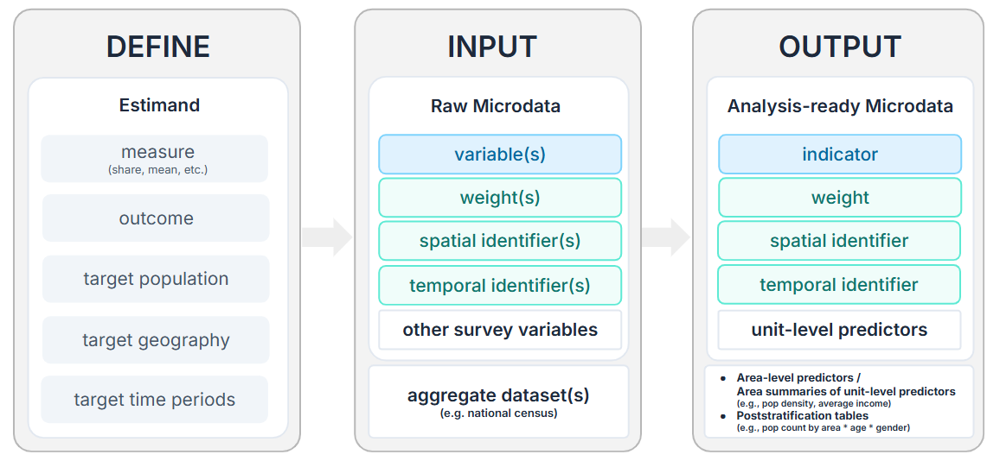

```{r}
#| label: data-setup
#| code-fold: true

library(dplyr)
library(readr)
library(stringr)
library(sf)
library(ggplot2)
library(patchwork)
library(scales)
library(spdep)

base_path <- here::here("data")
survey_microdata <- read_csv(file.path(base_path, "clean", "survey_microdata_msoayear.csv"), show_col_types = FALSE)

la_boundaries <- st_read(
  file.path(base_path, "boundaries-ltla.geojson"),
  quiet = TRUE
) |>
  transmute(la_code = LAD21CD) |>
  filter(str_starts(la_code, "W"))

msoa_boundaries <- st_read(
  file.path(base_path, "boundaries-msoa.geojson"),
  quiet = TRUE
) |>
  transmute(
    area_id = MSOA21CD,
    msoa_name = MSOA21NM
  ) |>
  filter(str_starts(area_id, "W"))
```

```{r}
#| label: data-plot-config
#| echo: false
missing_fill <- "grey85"
legend_bar_width <- grid::unit(4.5, "cm")
legend_bar_height <- grid::unit(0.35, "cm")

count_map_theme <- theme_void(base_size = 11) +
  theme(
    plot.title.position = "plot",
    plot.title = element_text(face = "bold", size = 13, hjust = 0.5),
    plot.subtitle = element_text(size = 10, hjust = 0.5, colour = "grey30"),
    legend.position = "bottom",
    legend.title = element_text(size = 10),
    legend.text = element_text(size = 9)
  )

chart_text_theme <- theme(
  plot.title.position = "plot",
  plot.title = element_text(size = 16, face = "bold", hjust = 0.5),
  plot.subtitle = element_text(size = 11, hjust = 0.5, colour = "grey30"),
  axis.title = element_text(size = 12),
  axis.text = element_text(size = 11),
  legend.text = element_text(size = 11)
)
```

## The Survey Microdata

The analysis uses a synthetic teaching dataset based on three waves of the **National Survey for Wales (NSW): 2020-2021, 2022-2023, and 2024-2025**.

The NSW is a repeated cross-sectional survey of people in Wales, with annual survey periods covering topics such as transport, health, education, public services, housing, internet access, climate change, and the Welsh language. The cleaned microdata combine three survey periods into one harmonised survey microdata.

The raw survey geography and stratification variable is Local Authority, while the estimation domain here is MSOA. The cleaned survey file therefore assigns each respondent to a synthetic MSOA within their Local Authority using deterministic random allocation. The resulting MSOA estimates should not be interpreted as substantive findings about individual places.

This design has two purposes:

- **Higher spatial resolution.** The synthetic MSOA assignment supports MSOA-level direct estimation, area-level SAE, spatial modelling, and unit-level SAE with poststratification.
- **Privacy and disclosure protection.** The assigned MSOA is not the respondent's true MSOA, so we avoid presenting fine-grained respondent locations. 

::: {.callout-note}
Survey period labels use their end year. For example, the `2020-2021` survey wave is labelled as the `2021` wave.
:::

```{r}
#| label: data-geo-counts
#| echo: false
#| fig-width: 12
#| fig-height: 7
#| out-width: "100%"
#| fig-align: "center"

la_response_counts <- survey_microdata |>
  filter(!is.na(strata)) |>
  count(strata, name = "responses")

msoa_response_counts <- survey_microdata |>
  filter(!is.na(area_id)) |>
  count(area_id, name = "responses")

la_count_map_data <- la_boundaries |>
  left_join(la_response_counts, by = c("la_code" = "strata"))

msoa_count_map_data <- msoa_boundaries |>
  left_join(msoa_response_counts, by = c("area_id" = "area_id"))

plot_response_map <- function(map_data, title, border_colour = "transparent") {
  ggplot(map_data) +
    geom_sf(
      aes(fill = responses),
      colour = border_colour,
      linewidth = 0.15
    ) +
    scale_fill_viridis_c(
      option = "magma",
      direction = -1,
      labels = label_comma(),
      na.value = missing_fill,
      guide = guide_colourbar(
        barwidth = legend_bar_width,
        barheight = legend_bar_height
      )
    ) +
    labs(title = title, fill = "Responses") +
    count_map_theme
}

la_count_map <- plot_response_map(
  la_count_map_data,
  "Original responses by Local Authority",
  border_colour = "white"
)

msoa_count_map <- plot_response_map(
  msoa_count_map_data,
  "Synthetic responses by MSOA"
)

wrap_plots(la_count_map, msoa_count_map, ncol = 2)
```

## Data Preparation Pipeline



### Defining The Estimand

The estimand is the quantity we want to estimate. It should be defined before preparing the survey indicator or choosing a model, because it determines the outcome coding, denominator, target geography, time period, auxiliary predictors, and poststratification requirements.

> Estimate **what outcome among which population**, across **which geography** and **time period**.

In spatio-temporal SAE, this estimand is evaluated for every combination of area and time period. Each combination is an **area-time cell**: one observation we want to estimate. Here, one area-time cell is one MSOA in one survey wave year, or an *MSOA-year cell*.

The estimand used here is:



### Preparing The Survey Indicator

The frequent-cycling indicator is coded from `AtFrqBke`, the active-travel frequency question for cycling.

| Field | Definition |
|---|---|
| Indicator name | `freq_biker` |
| Raw survey variable | `AtFrqBke` |
| Positive case | `AtFrqBke` is `1` or `2` (at least several times a week) |
| Negative case | Less frequent cycling or never cycling |
| Missing | Missing, invalid, or not asked |

Since the survey question was administered to all respondents during some survey periods and subsampled in others, the corresponding `weight` variable selection rule is as follows:

- Use `SampleTravelWeight` in survey waves where this question was asked to a subsample and the corresponding weight for this module exists, 
- Use `SampleAdultWeight` in survey waves where this question was asked to the main sample. 

The cycling survey indicator input has *one row per respondent-wave*:

| Column | Meaning |
|---|---|
| `unit_id` | Unique respondent identifier |
| `time_id` | Survey year |
| `area_id` | Synthetic MSOA assignment |
| `strata` | Local Authority stratum |
| `freq_biker` | Binary response for adults aged 16+ |
| `weight` | Matched weight |

```{r}
#| label: data-survey-indicator

read_csv(file.path(base_path, "clean", "surveyind_freqbike.csv"), show_col_types = FALSE) |>
  select(unit_id, time_id, area_id, strata, freq_biker, weight) |>
  head()
```

As an overview, the current cleaned data give the following usable observations for the cycling estimand:

| Year | Usable observations | MSOAs with usable observations |
|---:|---:|---:|
| 2021 | 3,438 | 408 |
| 2023 (subsampled) | 1,989 | 405 |
| 2025 | 5,886 | 408 |

Note that although the data have gaps when aggregated to the area-time level, or MSOA-year cells in this example, that is expected. SAE models will be used to borrow strength for sparse or unsampled cells.

### Preparing Auxiliary Data

#### Domain Frame and Spatial Graph

The domain frame defines the complete area-time grid where estimates are needed, including those that have no sample. It also stores the numeric area and time indices required by `INLA`.

```{r}
#| label: data-inla-indices

area_frame <- msoa_boundaries |>
  st_drop_geometry() |>
  distinct(area_id, msoa_name) |>
  arrange(area_id)

area_index <- area_frame |>
  select(area_id) |>
  arrange(area_id) |>
  mutate(area_inla_id = row_number())

time_index <- survey_microdata |>
  distinct(time_id) |>
  arrange(time_id) |>
  mutate(time_inla_id = row_number())

domain_frame <- tidyr::crossing(area_index, time_index) |>
  left_join(area_frame, by = "area_id") |>
  select(area_id, time_id, area_inla_id, time_inla_id, msoa_name)

write_csv(domain_frame, file.path(base_path, "clean", "domain_msoayear.csv"))

head(domain_frame)
```

To include spatial structure in the model, we need an adjacency matrix that encodes neighbouring MSOAs by their numeric codes. The graph uses Queen contiguity, where two MSOAs are treated as neighbours if their boundaries touch at either an edge or a point.


```{r}
#| label: data-inla-graph
msoa_boundaries_sorted <- msoa_boundaries |>
  inner_join(area_index, by = "area_id") |>
  arrange(area_inla_id)

msoa_neighbours <- poly2nb(
  msoa_boundaries_sorted,
  queen = TRUE,
  row.names = msoa_boundaries_sorted$area_id
)

# Write the Queen-contiguity graph in INLA's .adj format.
spatial_graph_file <- file.path(base_path, "clean", "msoa_queen.adj")
nb2INLA(
  file = spatial_graph_file,
  nb = msoa_neighbours
)
```

#### Modelling input
##### Unit-Level Predictors

Unit-level SAE models need predictors that can be used to model the outcome at the individual level. To model individual `freq_biker`, we extract or transform these unit-level predictors from the survey microdata *for each individual respondent row*:

| Column | Meaning |
|---|---|
| `age` | Respondent age |
| `sex` | Respondent sex (`1` for Male, `2` for Female) |
| `caraccess` | Binary car access predictor (`1` for car/van available, `0` for none available) |

```{r}
#| label: data-unit-predictors

read_csv(file.path(base_path, "clean", "surveyind_freqbike.csv"), show_col_types = FALSE) |>
  select(unit_id, time_id, area_id, freq_biker, sex, age, caraccess) |>
  head()
```

##### Area-level Predictors

Area-level SAE models need area-level predictors that plausibly explain between-area differences in the target outcome. The area predictors are drawn from [ONS UK Census 2021](https://www.ons.gov.uk/census) at MSOA level. These variables are chosen because frequent cycling is likely to vary with population composition, density, and car access.

The area-predictor input *has one row per MSOA*:

| Column | Meaning |
|---|---|
| `area_id` | MSOA estimation area |
| Raw predictors | `pop_density`; `age_adult_mean`; `female_adult_share`; `caraccess_adult_share` |
| Scaled predictors | Z-scored versions for model input |

```{r}
#| label: data-area-predictors

read_csv(file.path(base_path, "clean", "areapred_freqbike.csv"), show_col_types = FALSE) |>
  head()
```

#### Aggregation input (for unit-level SAE)
##### Predictor area summaries (See [unit-level SAE with predictor summaries](unit-sae-summ.qmd))

The raw area-level predictors `age_adult_mean`, `female_adult_share`, and `caraccess_adult_share` are defined for the adult target population, so they can also be used as predictor summaries to aggregate unit-level model predictions to target small areas.

##### Poststratification Table (See [unit-level SAE with poststratification](unit-sae-mrp.qmd))

Population cell counts (poststratification table) are another possible input needed to aggregate the fitted estimation model predictions to the target population for each area-time cell. We use a three-variable poststratification table with `age_band`, `sex`, and `caraccess`, sourced from [ONS UK Census 2021](https://www.ons.gov.uk/census).

The poststratification output *has one row per area-time-age-sex-caraccess combination*:

| Column | Meaning |
|---|---|
| `area_id` | MSOA estimation area |
| `time_id` | Survey year |
| `age_band` | Census age band |
| `sex` | Sex category (`1` for Male, `2` for Female) |
| `caraccess` | Household car-access category |
| `pop_count` | Adult population count |

```{r}
#| label: data-poststrat-head

read_csv(
  file.path(base_path, "clean", "poststrat_freqbike_age_sex_car_21.csv"),
  show_col_types = FALSE
) |>
  head()
```
