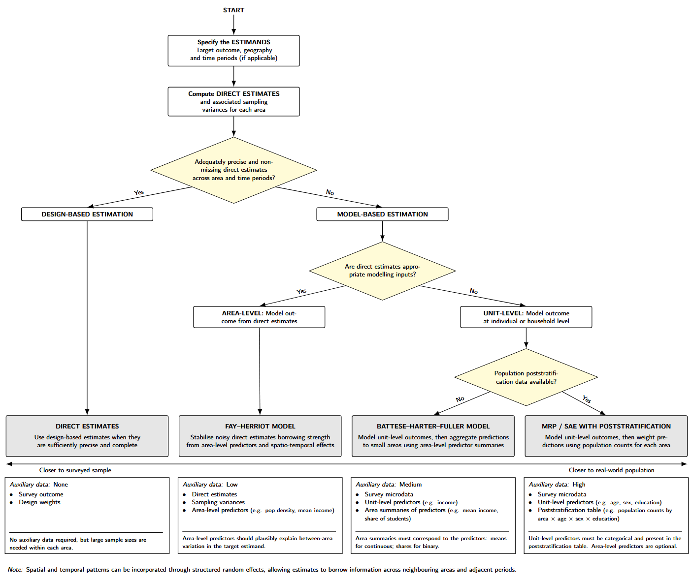

::: {.home-section}
::: {.section-label}
Small area estimation for Urban Analytics
:::
Urban researchers often want to use survey data at the scale where urban questions are asked: neighbourhoods, census blocks, transport zones, or other local units. This may involve comparing places, monitoring change over time, identifying local inequalities, or linking survey outcomes to area-level conditions. The problem is that most surveys are not designed to support reliable estimates at all geographic levels and time periods. When responses are broken down by area and year, some cells have only a few respondents and others have none.

This tutorial presents a workflow for choosing **spatio-temporal Bayesian small-area estimation (SAE)** methods for urban analytics. It focuses on method choice and shows how these approaches can be implemented in `R-INLA`.
:::

::: {.home-section}
::: {.section-label}
Bayesian inference and INLA
:::

Bayesian inference is used to combine survey evidence, auxiliary predictors, neighbouring-area structure, year-to-year structure, and uncertainty from sparse cells in one estimation framework. One advantage is that uncertainty of a modelled estimate is returned as posterior distributions for each estimate, which faciliates interpretation in policy contexts.

For code implementation, the examples are fitted with `R-INLA`, the R interface to *Integrated Nested Laplace Approximation*. INLA provides deterministic approximate Bayesian inference for latent Gaussian models, usually much faster than MCMC for this workflow.
:::

::: {.home-section}
::: {.section-label}
Tutorial structure
:::

The tutorial is selective. It covers the SAE methods most relevant to common Urban Analytics survey and auxiliary datasets, with the choice driven by outcome type, available survey information, auxiliary data, and population structure.

1. **[Prepare data](dataprep.qmd)**  
   Build the survey indicator, matched weights, area predictors, unit predictors, and poststratification inputs.

2. **[Direct estimation](direct-estimation.qmd)**  
   Produce survey design-based small area estimates and sampling variances. This establishes the baseline and shows where direct estimates are too sparse or noisy.

3. **[Fay--Herriot area-level model](fh-area.qmd)**  
   Model the direct estimates and their sampling variances using area-level predictors, and structured temporal and spatial random effects.

4. **[Battese--Harter--Fuller unit-level model](bhf-unit.qmd)**  
   Model survey microdata directly using unit-level predictors and structured temporal and spatial random effects, then aggregate the fitted relationship to small-area estimates.

5. **[Multilevel Regression with Poststratification (MRP)](mrp.qmd)**  
   Fit a richer unit-level model and project predictions over population poststratification cells.
:::

::: {.home-section}
::: {.section-label}
Worked example
:::

The worked example found throughout this tutorial uses synthetic datasets based on the [**National Survey for Wales**](https://www.gov.wales/national-survey-wales)

The maps and estimates illustrate the workflow and should not be interpreted as empirical findings for specific places in Wales. The synthetic dataset construction and preprocessing steps are described in the [data preparation step](dataprep.qmd).
:::
