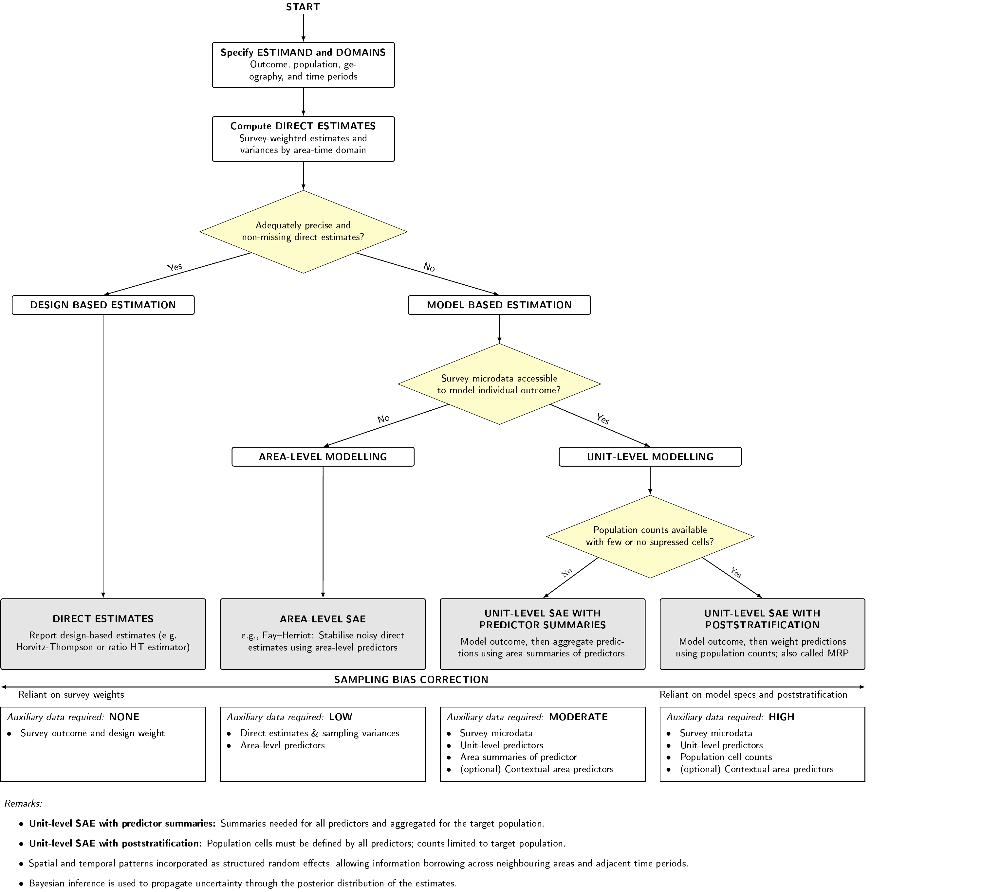

{width="100%"}

::: {.home-section}
::: {.section-label}
Small area estimation for Urban Analytics
:::

Urban researchers rely on surveys to understand populations and how they change over time. They often need to examine survey results at different spatial scales--such as neighbourhoods, census blocks, or transport zones--to compare places, track local trends, identify inequalities, and explore links with area-level conditions. The problem is that simply grouping survey responses by area can leave too few respondents to produce reliable estimates. Combining responses from several survey years can increase the sample size, but it may obscure changes over time and introduce bias if differences between years are not properly accounted for.

This guide introduces several **spatio-temporal Bayesian small area estimation (SAE)** methods for urban analytics, with implementation in `INLA`. It aims to help researchers choose a method suited to their research needs and data limitations.
:::

::: {.home-section}
::: {.section-label}
Bayesian inference and INLA
:::

Bayesian inference combines survey evidence, auxiliary predictors, neighbouring-area structure, year-to-year structure, and uncertainty from sparse cells in one estimation framework. Modelled estimates are returned as posterior distributions, which makes uncertainty explicit.

The examples use `R-INLA`, the R interface to *Integrated Nested Laplace Approximation*. `INLA` provides deterministic approximate Bayesian inference for latent Gaussian models, usually much faster than MCMC for this workflow.
:::

::: {.home-section}
::: {.section-label}
Navigating the guide
:::

The guide covers SAE routes commonly used with urban survey and auxiliary datasets. Method choice depends on the outcome, survey information, auxiliary data, and available population structure.

{width="100%"}

1. **[Estimation setup](dataprep.qmd)**
2. **[Direct estimation](direct-estimation.qmd)**
3. **[Modelling: Area-level SAE](area-sae-fh.qmd)**
4. **[Modelling: Unit-level SAE with area summaries](unit-sae-summ.qmd)**
5. **[Modelling: Unit-level SAE with poststratification](unit-sae-mrp.qmd)**
6. **[Comparative diagnostics](diagnostics.qmd)**
7. **[Toolkit](toolkit.qmd)**
:::

::: {.home-section}
::: {.section-label}
Data
:::

The data are synthetic datasets based on the [**National Survey for Wales**](https://www.gov.wales/national-survey-wales). The maps and estimates should not be interpreted as empirical findings about specific places in Wales. Auxiliary predictors, boundaries, and poststratification tables are derived from the *Office for National Statistics (ONS)*, including ONS UK Census 2021. The synthetic dataset construction and preprocessing steps are described in the [estimation setup](dataprep.qmd).
:::

::: {.home-section}
::: {.section-label}
About the project
:::

The tutorial is part of the **TRACK-UK** project by the [**City Modelling Lab**](https://citymodellinglab.uk).

TRACK-UK develops spatial and statistical methods for analysing mobility patterns at fine geographic scales and assessing their implications for transport decarbonisation in the UK. The project works with academic, policy, and industry partners to produce evidence for transport and energy policy.

For questions about the guide, contact:

- **Shaun Hoang** - University College London
- **Anna Freni-Sterrantino** - The Alan Turing Institute
- **Esra Suel** - University College London; University of Zurich
:::

::: {.home-section}
::: {.section-label}
Bibliography
:::

**Survey Estimation and Small Area Estimation**

- Horvitz, D. G., and Thompson, D. J. (1952). "A Generalization of Sampling Without Replacement from a Finite Universe." *Journal of the American Statistical Association*, 47(260), 663-685. doi:10.1080/01621459.1952.10483446.
- Fay, R. E., and Herriot, R. A. (1979). "Estimates of Income for Small Places: An Application of James-Stein Procedures to Census Data." *Journal of the American Statistical Association*, 74(366), 269-277. doi:10.1080/01621459.1979.10482505.
- Battese, G. E., Harter, R. M., and Fuller, W. A. (1988). "An Error-Components Model for Prediction of County Crop Areas Using Survey and Satellite Data." *Journal of the American Statistical Association*, 83(401), 28-36. doi:10.1080/01621459.1988.10478561.
- Rao, J. N. K., and Yu, M. (1994). "Small-Area Estimation by Combining Time-Series and Cross-Sectional Data." *Canadian Journal of Statistics*, 22(4), 511-528. doi:10.2307/3315407.

**Multilevel Regression with Poststratification**

- Gelman, A., and Little, T. C. (1997). "Poststratification into Many Categories Using Hierarchical Logistic Regression." *Survey Methodology*, 23(2), 127-135.
- Park, D. K., Gelman, A., and Bafumi, J. (2004). "Bayesian Multilevel Estimation with Poststratification: State-Level Estimates from National Polls." *Political Analysis*, 12(4), 375-385. doi:10.1093/pan/mph024.

**Bayesian Spatial and Spatio-Temporal Modelling**

- Besag, J., York, J., and Mollié, A. (1991). "Bayesian Image Restoration, with Two Applications in Spatial Statistics." *Annals of the Institute of Statistical Mathematics*, 43(1), 1-20. doi:10.1007/BF00116466.
- Rue, H., Martino, S., and Chopin, N. (2009). "Approximate Bayesian Inference for Latent Gaussian Models by Using Integrated Nested Laplace Approximations." *Journal of the Royal Statistical Society: Series B*, 71(2), 319-392. doi:10.1111/j.1467-9868.2008.00700.x.
- Riebler, A., Sørbye, S. H., Simpson, D., and Rue, H. (2016). "An Intuitive Bayesian Spatial Model for Disease Mapping That Accounts for Scaling." *Statistical Methods in Medical Research*, 25(4), 1145-1165. doi:10.1177/0962280216660421.
:::
