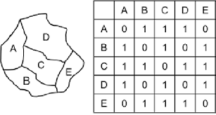

```{r}
#| label: setup-area-level
library(dplyr)
library(readr)
library(stringr)
library(tidyr)
library(sf)
library(ggplot2)
library(patchwork)
library(spdep)
library(INLA)
library(tibble)
library(purrr)
library(scales)

base_path <- here::here("data")
domain_frame <- read_csv(
  file.path(base_path, "clean", "msoa_year_domain_frame.csv"),
  show_col_types = FALSE
)

msoa_boundaries <- st_read(
  file.path(base_path, "boundaries-msoa.geojson"),
  quiet = TRUE
) |>
  rename(msoa_code = all_of("MSOA21CD")) |>
  filter(str_starts(.data$msoa_code, "W")) |>
  arrange(.data$msoa_code)
```

```{r}
#| label: plotting-config
share_label <- label_percent(accuracy = 0.1)
pp_label <- label_number(accuracy = 0.1, scale = 100, suffix = " pp")
variance_label <- label_number(accuracy = 0.0001)
missing_fill <- "grey85"
diverging_low <- "#2166ac"
diverging_high <- "#b2182b"

map_text_theme <- theme(
  plot.title = element_text(size = 12, face = "bold", hjust = 0.5),
  axis.title.y = element_text(
    size = 12,
    face = "bold",
    angle = 90,
    margin = margin(r = 15)
  ),
  legend.title = element_text(size = 10),
  legend.text = element_text(size = 9)
)

chart_text_theme <- theme(
  plot.title = element_text(size = 18, face = "bold", hjust = 0.5),
  strip.text = element_text(size = 14, face = "bold"),
  axis.title = element_text(size = 14),
  axis.text = element_text(size = 12),
  legend.text = element_text(size = 12)
)

map_annotation_theme <- theme(
  plot.title = element_text(size = 18, face = "bold", hjust = 0.5),
  plot.subtitle = element_text(size = 12, hjust = 0.5, colour = "grey30")
)
```

Area-level SAE starts from the direct estimates created in the previous workbook. The Fay--Herriot model lets direct estimates for each MSOA--year borrow strength from predictors and spatial and temporal structures to stabilise noisy estimates.

As a reminder, our estimand is 

>  Share of Welsh adults who walk for transport daily by MSOA in 2021, 2023 and 2025

## Define Domain, Indices And Spatial Graph

First we join the complete MSOA--year domain to the direct estimates and their sampling variances from the previous workbook.

```{r}
#| label: load-direct-estimates
direct_estimates <- read_csv(
  file.path(base_path, "freq_walker_estimates_direct.csv"),
  show_col_types = FALSE
) |>
  select(-.data$msoa_name)

direct_walk <- domain_frame |>
  left_join(direct_estimates, by = c("msoa_code", "wave_year"))

head(direct_walk)
```

Before fitting the models, we create a consistent numeric index for each MSOA and survey year. These indices are used by `INLA` to attach random effects to the correct area and period. 

```{r}
#| label: define-model-index
#| code-fold: false

area_levels <- sort(unique(domain_frame[["msoa_code"]]))
year_levels <- sort(unique(domain_frame[["wave_year"]]))

area_index <- tibble(
  msoa_code = area_levels,
  area_id = seq_along(area_levels)
)

year_index <- tibble(
  wave_year = year_levels,
  year_id = seq_along(year_levels)
)
```

To include a spatial random effect, we also need an adjacency graph `.adj` as input. We use Queen contiguity, where two MSOAs are treated as neighbours if their boundaries touch at either an edge or a point. The boundary file is sorted using `area_index` so that the graph order matches the area IDs used in the modelling data.



```{r}
#| label: build-spatial-graph
#| code-fold: false

msoa_boundaries_sorted <- msoa_boundaries |>
  inner_join(area_index, by = "msoa_code") |>
  arrange(.data$area_id)

msoa_neighbours <- poly2nb(
  msoa_boundaries_sorted,
  queen = TRUE,
  row.names = msoa_boundaries_sorted$msoa_code
)

spatial_graph_file <- tempfile(fileext = ".adj")

nb2INLA(
  file = spatial_graph_file,
  nb = msoa_neighbours
)
```

## Prepare Modelling Data

We then load the area predictors and assemble the modelling data.

The models use two area-level random-effect structures, so we create separate `INLA` index variables:

- `area_iid_id` indexes the unstructured, independent area effect.
- `area_spatial_id` indexes the structured spatial area effect, which uses the adjacency graph.

Lastly, the sampling variance also needs careful handling before fitting the FH models with `INLA`. The extent to which the noisy direct estimates will be stablised depends on their sampling variances.

- For MSOA-year small areas without a direct estimate or variance, we assign the maximum observed positive sampling variance, signalling high uncertainty. Their estimates will be mostly model predictions.
- Because the outcome is binary (`1` for walking daily, `0` otherwise), very small samples can produce a variance of `0` when all sampled respondents give the same response. We also assign these cells the maximum observed positive sampling variance.

```{r}
#| label: prepare-model-data
#| code-fold: false

max_variance <- max(
  direct_walk$variance[direct_walk$variance > 0],
  na.rm = TRUE
)

area_covariates <- read_csv(
  file.path(base_path, "clean", "area_covariates_daily_walking.csv"),
  show_col_types = FALSE
) |>
  select(
    all_of(c(
      "msoa_code",
      "cov_population_density",
      "cov_share_no_car_households",
      "cov_share_work_from_home",
      "cov_share_students",
      "cov_share_routine_semiroutine"
    ))
  )

model_data <- direct_walk |>
  left_join(area_covariates, by = "msoa_code") |>
  left_join(area_index, by = "msoa_code") |>
  left_join(year_index, by = "wave_year") |>
  mutate(
    area_iid_id = area_id,
    area_spatial_id = area_id,
    sampling_variance = case_when(
      is.na(.data$direct_estimate) ~ max_variance,
      is.na(.data$variance) ~ max_variance,
      .data$variance <= 1e-8 ~ max_variance,
      TRUE ~ .data$variance
    )
  ) |>
  arrange(.data$wave_year, .data$area_id)

head(model_data)
```

## Fit And Evaluate Models

Each model uses the direct estimate as the response. The sampling variance from the direct-estimation workbook is passed to `INLA` as known observation-level uncertainty, so cells with noisy direct estimates receive less weight.

We define these model specifications and fit each one to the direct estimates using `INLA`. 

| Model | Name | Specifications |
|---|---|---|
| M0 | Baseline | Intercept plus independent area effect |
| M1 | +Temporal | M0 plus temporal random walk |
| M2 | +Core predictors | M1 plus population density and no-car households |
| M3 | +All predictors | M2 plus economic activities (full-time students, semi-routine/routine occupation, WFH) |
| M4 | +Spatial | M3 plus spatial structure among MSOA adjacency |

```{r}
#| label: fit-fh-models
#| code-fold: false

m0_formula <- direct_estimate ~
  1 +
  f(area_iid_id, model = "iid")

m1_formula <- direct_estimate ~
  1 +
  f(area_iid_id, model = "iid") +
  f(year_id, model = "rw1", constr = TRUE)

m2_formula <- direct_estimate ~
  cov_population_density +
  cov_share_no_car_households +
  f(area_iid_id, model = "iid") +
  f(year_id, model = "rw1", constr = TRUE)

m3_formula <- direct_estimate ~
  cov_population_density +
  cov_share_no_car_households +
  cov_share_work_from_home +
  cov_share_students +
  cov_share_routine_semiroutine +
  f(area_iid_id, model = "iid") +
  f(year_id, model = "rw1", constr = TRUE)

m4_formula <- direct_estimate ~
  cov_population_density +
  cov_share_no_car_households +
  cov_share_work_from_home +
  cov_share_students +
  cov_share_routine_semiroutine +
  f(
    area_spatial_id,
    model = "bym2",
    graph = spatial_graph_file,
    scale.model = TRUE,
    constr = TRUE
  ) +
  f(year_id, model = "rw1", constr = TRUE)

model_formulas <- list(
  "M0 Baseline" = m0_formula,
  "M1 +Temporal" = m1_formula,
  "M2 +Core predictors" = m2_formula,
  "M3 +All predictors" = m3_formula,
  "M4 +Spatial" = m4_formula
)

fit_fh_model <- function(formula) {
  inla(
    formula = formula,
    family = "gaussian",
    data = model_data,
    scale = 1 / model_data$sampling_variance,
    control.family = list(
      hyper = list(
        prec = list(initial = 0, fixed = TRUE)
      )
    ),
    control.predictor = list(compute = TRUE),
    control.compute = list(dic = TRUE, waic = TRUE),
    verbose = FALSE
  )
}

model_order <- names(model_formulas)
fh_fits <- lapply(model_formulas, fit_fh_model)
```

Next, we use **WAIC** as a first check for comparing the fitted model specifications. WAIC, returned by `INLA`, is a global predictive-fit measure: lower values indicate better expected prediction after penalising model complexity.

```{r}
#| label: waic-comparison

model_waic <- imap_dfr(
  fh_fits,
  \(fit, model_name) {
    tibble(
      model = model_name,
      waic = fit$waic$waic,
      eff_params = fit$waic$p.eff
    )
  }
)

model_waic
```

M2 has the lowest WAIC, while M0 is clearly the weakest model. This suggests that the temporal term and the two core predictors, population density and car access, already capture much of the area-level variability. The differences among M1-M4 are small, so we treat them as having broadly similar predictive performance. 

Because WAIC is a global summary, we next look at how estimates change locally as terms are added.

## Compare Stepwise Estimate Changes

At this point the result is just a named list of fitted `INLA` models. We will collate the fitted values into one results table together with their original direct estimates and sampling variances. 

```{r}
#| label: collate-fh-results

# Main frame to keep from model data
output_cols <- c(
  "msoa_code",
  "wave_year",
  "msoa_name",
  "direct_estimate",
  "variance",
  "n"
)

model_output_frame <- select(model_data, all_of(output_cols))

# Extract fitted values from each model and bind them to the frame
fh_result_tables <- map2(
  fh_fits,
  names(fh_fits),
  function(fit, model_name) {
    fitted_values <- as_tibble(fit$summary.fitted.values)

    model_results <- bind_cols(model_output_frame, fitted_values)

    transmute(
      model_results,
      model = model_name,
      across(all_of(output_cols)),
      fh_estimate = .data$mean,
      fh_variance = .data$sd^2,
      has_direct = !is.na(.data$direct_estimate)
    )
  }
)

# Stack model outputs and set display order
fh_results <- bind_rows(fh_result_tables)
fh_results <- mutate(
  fh_results,
  model = factor(.data$model, levels = model_order)
)

head(fh_results)
```

### Direct To Baseline Model

We start by comparing the direct estimates with M0, the baseline Fay-Herriot model with no area predictors, spatial structure, or temporal structure to understand how the FH models fundamentally handle noisy direct estimates. 

```{r}
#| label: direct-to-m0-comparison
#| fig-width: 16
#| fig-height: 12
#| out-width: "100%"

fh_wide <- fh_results |>
  # One row per MSOA-year, with model outputs in separate columns.
  select(
    msoa_code,
    wave_year,
    model,
    direct_estimate,
    variance,
    fh_estimate,
    fh_variance
  ) |>
  pivot_wider(
    names_from = model,
    values_from = c(fh_estimate, fh_variance),
    names_sep = "__"
  )

direct_to_m0 <- fh_wide |>
  transmute(
    msoa_code,
    wave_year,
    direct_variance = variance,
    variance_change = .data[["fh_variance__M0 Baseline"]] - .data$variance
  )

variance_change_limit <- max(abs(direct_to_m0$variance_change), na.rm = TRUE) * .5
direct_variance_limit <- max(direct_to_m0$direct_variance, na.rm = TRUE)

direct_to_m0_map_data <- msoa_boundaries |>
  left_join(direct_to_m0, by = "msoa_code")

wave_years <- sort(unique(fh_wide$wave_year))

plot_m0_variance_change <- function(wave) {
  direct_to_m0_map_data |>
    filter(.data$wave_year == wave) |>
    ggplot() +
    geom_sf(aes(fill = .data$variance_change), colour = "transparent") +
    scale_fill_gradient2(
      low = diverging_low,
      mid = "white",
      high = diverging_high,
      midpoint = 0,
      limits = c(-variance_change_limit, variance_change_limit),
      oob = squish,
      labels = variance_label,
      na.value = missing_fill,
      name = "Change"
    ) +
    ggtitle(wave) +
    theme_void() +
    map_text_theme
}

plot_direct_variance <- function(wave) {
  direct_to_m0_map_data |>
    filter(.data$wave_year == wave) |>
    ggplot() +
    geom_sf(aes(fill = .data$direct_variance), colour = "transparent") +
    scale_fill_distiller(
      palette = "Reds",
      direction = 1,
      limits = c(0, direct_variance_limit),
      labels = variance_label,
      na.value = missing_fill,
      name = "Variance"
    ) +
    ggtitle(wave) +
    theme_void() +
    map_text_theme
}

variance_change_maps <- lapply(wave_years, plot_m0_variance_change)
direct_variance_maps <- lapply(wave_years, plot_direct_variance)

variance_change_maps[[1]] <- variance_change_maps[[1]] +
  ylab("Variance change")
direct_variance_maps[[1]] <- direct_variance_maps[[1]] +
  ylab("Direct variance")

for (i in seq_len(length(wave_years) - 1)) {
  variance_change_maps[[i]] <- variance_change_maps[[i]] +
    theme(legend.position = "none")
  direct_variance_maps[[i]] <- direct_variance_maps[[i]] +
    theme(legend.position = "none")
}

direct_to_m0_ranked <- direct_to_m0 |>
  filter(!is.na(variance_change)) |>
  group_by(wave_year) |>
  # Rank within each wave by the original direct-estimate variance.
  arrange(direct_variance, .by_group = TRUE) |>
  mutate(variance_rank = row_number()) |>
  ungroup() |>
  select(
    wave_year,
    variance_rank,
    `Variance change` = variance_change,
    `Variance (direct)` = direct_variance
  ) |>
  pivot_longer(
    cols = -c(wave_year, variance_rank),
    names_to = "measure",
    values_to = "value"
  )

direct_to_m0_ranked_plot <- ggplot(
  direct_to_m0_ranked,
  aes(
    x = .data$variance_rank,
    y = .data$value,
    colour = .data$measure
  )
) +
  geom_hline(yintercept = 0, colour = "grey60") +
  geom_line(alpha = 0.8) +
  facet_wrap(vars(.data$wave_year), nrow = 1) +
  scale_y_continuous(labels = variance_label) +
  scale_colour_manual(values = c(
    "Variance change" = "purple",
    "Variance (direct)" = "red"
  )) +
  labs(
    title = "",
    x = "MSOAs sorted by variance",
    y = "Variance",
    colour = NULL
  ) +
  theme_minimal() +
  chart_text_theme

(wrap_plots(c(variance_change_maps, direct_variance_maps), ncol = 3) /
  direct_to_m0_ranked_plot) +
  plot_layout(heights = c(2, 1)) +
  plot_annotation(
    title = "Direct estimates compared with baseline FH model (M0)",
    subtitle = "M0 stabilises noisy direct estimates before adding predictors or spatio-temporal structure",
    theme = map_annotation_theme
  )
```
MSOA-years with high sampling variance contain less reliable local information, so M0 pulls them more strongly toward its baseline prediction.

Moreover, because the Bayesian FH model estimates a posterior distribution, cells with missing direct estimates or zero/missing variance can still receive a model-based estimate, reported as a posterior mean with associated uncertainty. This is a benefit of the Bayesian approach in small area estimation where survey information is sparse or unavailable for several small areas.

```{r}
#| label: missing-direct-m0-estimates
fh_wide |>
  filter(is.na(.data$direct_estimate) | is.na(.data$variance)) |>
  transmute(
    `MSOA` = .data$msoa_code,
    `Wave year` = .data$wave_year,
    `Direct estimate` = share_label(.data$direct_estimate),
    `Sampling variance` = round(.data$variance, 6),
    `M0 estimate` = share_label(.data[["fh_estimate__M0 Baseline"]]),
    `M0 posterior variance` = round(
      .data[["fh_variance__M0 Baseline"]],
      6
    )
  )
```

## Adding Predictors

WAIC is useful, but it does not show where estimates change locally or whether those changes are substantive. 

For Fay-Herriot SAE models, the final aim is stabilising noisy local estimates. When predictors are added, the model updates the expected value for each MSOA-year. Unstable direct estimates are then pulled more strongly toward those updated model predictions, which can improve local accuracy when the predictors are relevant.

For example, moving from M2 to M3 adds the occupation and work-pattern predictors. We map where M3 changes the estimates relative to M2, then summarise the predictor profiles of the areas with the largest upward and downward shifts (top and bottom 10%).

```{r}
#| fig-width: 16
#| fig-height: 5
#| out-width: "100%"

m2_to_m3 <- fh_wide |>
  transmute(
    msoa_code,
    wave_year,
    estimate_change =
      .data[["fh_estimate__M3 +All predictors"]] - 
      .data[["fh_estimate__M2 +Core predictors"]]
  )

m2_to_m3_map_data <- msoa_boundaries |>
  left_join(m2_to_m3, by = "msoa_code")

m2_to_m3_estimate_limit <- quantile(
  abs(m2_to_m3$estimate_change),
  0.95,
  na.rm = TRUE,
  names = FALSE
)

plot_m2_to_m3_change <- function(wave) {
  m2_to_m3_map_data |>
    filter(.data$wave_year == wave) |>
    ggplot() +
    geom_sf(aes(fill = .data$estimate_change), colour = "transparent") +
    scale_fill_gradient2(
      low = diverging_low,
      mid = "white",
      high = diverging_high,
      midpoint = 0,
      limits = c(-m2_to_m3_estimate_limit, m2_to_m3_estimate_limit),
      oob = squish,
      labels = pp_label,
      na.value = missing_fill,
      name = "Change"
    ) +
    ggtitle(wave) +
    theme_void() +
    map_text_theme
}

m2_to_m3_maps <- lapply(wave_years, plot_m2_to_m3_change)
m2_to_m3_maps[[1]] <- m2_to_m3_maps[[1]] + ylab("Estimate change")

for (i in seq_len(length(wave_years) - 1)) {
  m2_to_m3_maps[[i]] <- m2_to_m3_maps[[i]] +
    theme(legend.position = "none")
}

wrap_plots(m2_to_m3_maps, ncol = 3) +
  plot_annotation(
    title = "Estimate change after adding additional predictors",
    subtitle = "M3 minus M2",
    theme = map_annotation_theme
  )
```
```{r}
m2_to_m3_drivers <- model_data |>
  select(
    msoa_code,
    wave_year,
    work_from_home = cov_share_work_from_home,
    students = cov_share_students,
    routine_semiroutine = cov_share_routine_semiroutine
  ) |>
  left_join(m2_to_m3, by = c("msoa_code", "wave_year")) |>
  mutate(
    change_group = case_when(
      estimate_change >= quantile(estimate_change, 0.9, na.rm = TRUE) ~
        "Raised most by M3",
      estimate_change <= quantile(estimate_change, 0.1, na.rm = TRUE) ~
        "Lowered most by M3",
      TRUE ~ NA_character_
    )
  )

m2_to_m3_drivers |>
  filter(!is.na(.data$change_group)) |>
  group_by(.data$change_group) |>
  summarise(
    `Work from home` = mean(.data$work_from_home, na.rm = TRUE),
    `Students` = mean(.data$students, na.rm = TRUE),
    `Routine or semi-routine` = mean(.data$routine_semiroutine, na.rm = TRUE),
    .groups = "drop"
  )
```
The areas whose estimates are raised most by M3 have higher work-from-home and student shares, and lower routine/semi-routine occupation shares. This pattern is plausible: students and remote workers may have more flexible daily routines, shorter local trips, or lower car dependence, all of which could be associated with more walking for transport. 

This makes the M3 shifts interpretable and gives some support for including these additional predictors, despite slightly lower WAIC.

## Adding Temporal And Spatial Effects

The contribution of the temporal and spatial effects on the model prediction can be exmined through two diagnostic outputs by `INLA`:

- `tau` is the precision of the random effect, or the inverse of its variance. A higher `tau` means the random effect varies less.
- `phi` is the BYM2 mixing parameter: it indicates how much of the area random effect is assigned to the structured spatial component versus the unstructured component. A value of `0.5` means the structured and unstructured components contribute roughly equally to the area random effect.

The **temporal effect** has a high `tau` (`6091.734`), which means the model estimates only small differences between the three survey waves. The effect is still useful to include because it lets the model account for wave-to-wave changes insteading of treating survey responses from all waves as one.
```{r}
#| label: temporal-tau

fh_fits[["M1 +Temporal"]]$summary.hyperpar |>
  as_tibble(rownames = "parameter") |>
  filter(str_detect(.data$parameter, "year_id")) |>
  select(parameter, mean, sd, `0.025quant`, `0.5quant`, `0.975quant`) |>
  mutate(
    across(where(is.numeric), ~ round(.x, 3))
  )
```

The **spatial effect** has a lower `tau` (`102.617`) than the temporal effect, which suggests that there is more residual variation between MSOAs than between survey waves. However, its low `phi` (`0.032`) suggests that only a very small share of that remaining between-area variation follows the provided spatial weights. Most of the remaining area-level variation is unstructured, which helps explain why adding the spatial structure to the random area effects does not improve WAIC.

```{r}
#| label: spatial-tau-phi
#| 
fh_fits[["M4 +Spatial"]]$summary.hyperpar |>
  as_tibble(rownames = "parameter") |>
  filter(
    str_detect(.data$parameter, "area_spatial_id|Phi")
  ) |>
  select(parameter, mean, sd, `0.025quant`, `0.5quant`, `0.975quant`) |>
  mutate(
    across(where(is.numeric), ~ round(.x, 3))
  )
```

Even so, it is still useful to map the estimate change from M3 to M4, because a weak global contribution can still produce local smoothing in specific areas that is plausible and defensible. 

```{r}
#| label: spatial-change-map
#| fig-width: 16
#| fig-height: 5
#| out-width: "100%"

m3_to_m4 <- fh_wide |>
  transmute(
    msoa_code,
    wave_year,
    estimate_change =
      .data[["fh_estimate__M4 +Spatial"]] -
      .data[["fh_estimate__M3 +All predictors"]]
  )

m3_to_m4_map_data <- msoa_boundaries |>
  left_join(m3_to_m4, by = "msoa_code")

m3_to_m4_limit <- quantile(
  abs(m3_to_m4$estimate_change),
  0.95,
  na.rm = TRUE,
  names = FALSE
)

plot_m3_to_m4_change <- function(wave) {
  m3_to_m4_map_data |>
    filter(.data$wave_year == wave) |>
    ggplot() +
    geom_sf(aes(fill = .data$estimate_change), colour = "transparent") +
    scale_fill_gradient2(
      low = diverging_low,
      mid = "white",
      high = diverging_high,
      midpoint = 0,
      limits = c(-m3_to_m4_limit, m3_to_m4_limit),
      oob = squish,
      labels = pp_label,
      na.value = missing_fill,
      name = "Change"
    ) +
    ggtitle(wave) +
    theme_void() +
    map_text_theme
}

m3_to_m4_maps <- lapply(wave_years, plot_m3_to_m4_change)
m3_to_m4_maps[[1]] <- m3_to_m4_maps[[1]] + ylab("Estimate change")

for (i in seq_len(length(wave_years) - 1)) {
  m3_to_m4_maps[[i]] <- m3_to_m4_maps[[i]] +
    theme(legend.position = "none")
}

wrap_plots(m3_to_m4_maps, ncol = 3) +
  plot_annotation(
    title = "Estimate change after adding spatial smoothing",
    subtitle = "M4 minus M3",
    theme = map_annotation_theme
  )
```
The maps show small local clusters of spatial smoothing. For exampl, in parts of southern Wales, where several neighbouring MSOAs have higher estimated daily-walking rates, estimates of nearby areas are raised.

## Report Final Estimates And Uncertainty

Choosing the final model therefore requires balanced judgement, combining performance diagnostics such as `INLA`'s WAIC with domain knowledge about the estimand. Where possible, model choice can also be strengthened through further benchmarking, such as comparison with related external indicators or sensitivity checks.

The final model estimates should be reported with their associated uncertainty. For transparency in downstream use of the output datasets, they should also be accompanied by relevant metadata, including the direct estimates, sample sizes, sampling variances, and the modelling specification used to produce them.

```{r}
#| label: final-model-map
#| fig-width: 16
#| fig-height: 12
#| out-width: "100%"

# Keep only the final, most structured model.
final_model_results <- fh_results |>
  filter(.data$model == "M4 +Spatial")
final_map_data <- msoa_boundaries |>
  left_join(final_model_results, by = "msoa_code")
final_estimate_limits <- range(final_model_results$fh_estimate, na.rm = TRUE)
final_variance_limits <- c(0, max(final_model_results$fh_variance, na.rm = TRUE))
final_wave_years <- sort(unique(final_model_results$wave_year))

plot_final_estimate <- function(wave) {
  final_map_data |>
    filter(.data$wave_year == wave) |>
    ggplot() +
    geom_sf(aes(fill = .data$fh_estimate), colour = "transparent") +
    scale_fill_viridis_c(
      option = "magma",
      limits = final_estimate_limits,
      labels = share_label,
      na.value = missing_fill,
      name = "Share"
    ) +
    ggtitle(wave) +
    theme_void() +
    map_text_theme
}

plot_final_variance <- function(wave) {
  final_map_data |>
    filter(.data$wave_year == wave) |>
    ggplot() +
    geom_sf(aes(fill = .data$fh_variance), colour = "transparent") +
    scale_fill_distiller(
      palette = "Oranges",
      direction = 1,
      limits = final_variance_limits,
      labels = variance_label,
      na.value = missing_fill,
      name = "Variance"
    ) +
    ggtitle(wave) +
    theme_void() +
    map_text_theme
}

estimate_maps <- lapply(final_wave_years, plot_final_estimate)
uncertainty_maps <- lapply(final_wave_years, plot_final_variance)

estimate_maps[[1]] <- estimate_maps[[1]] + ylab("Final estimate")
uncertainty_maps[[1]] <- uncertainty_maps[[1]] + ylab("Posterior variance")

for (i in seq_len(length(final_wave_years) - 1)) {
  estimate_maps[[i]] <- estimate_maps[[i]] +
    theme(legend.position = "none")
  uncertainty_maps[[i]] <- uncertainty_maps[[i]] +
    theme(legend.position = "none")
}

wrap_plots(c(estimate_maps, uncertainty_maps), ncol = 3) +
  plot_annotation(
    title = "Share of adults who walk for transport daily",
    subtitle = "Spatio-temporal FH model with five predictors (M4)",
    theme = map_annotation_theme
  )
```

Even after the direct estimates have been stabilised through the Fay-Herriot model, weaker survey coverage can still leave unusual year-specific patterns in the modelled estimates. 2023 estimates are generally higher than in 2021 and 2025, likely due to that wave's smaller sample size. Therefore, for transparency, the modelled estimates should always be read alongside their posterior uncertainty and the original sample sizes.

```{r}
#| label: export-fh-results
#| echo: false
write_csv(
  final_model_results,
  file.path(base_path, "freq_walker_estimates_area-fh.csv")
)
```

